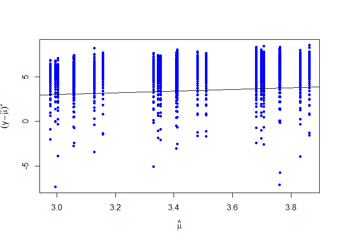
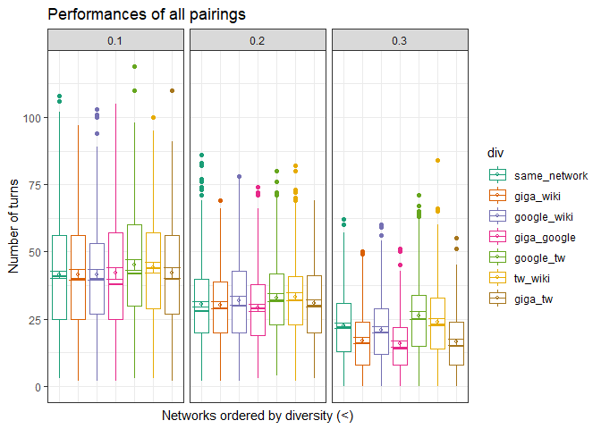
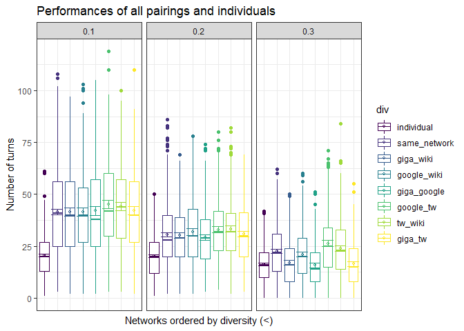
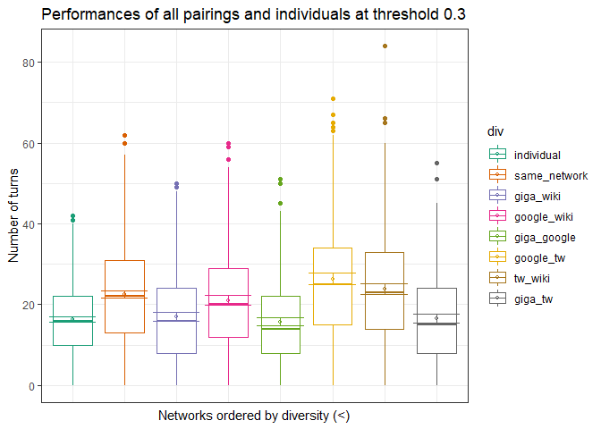
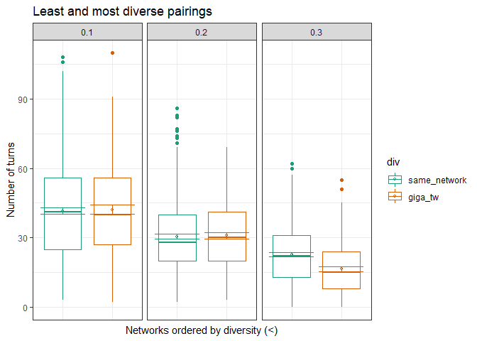
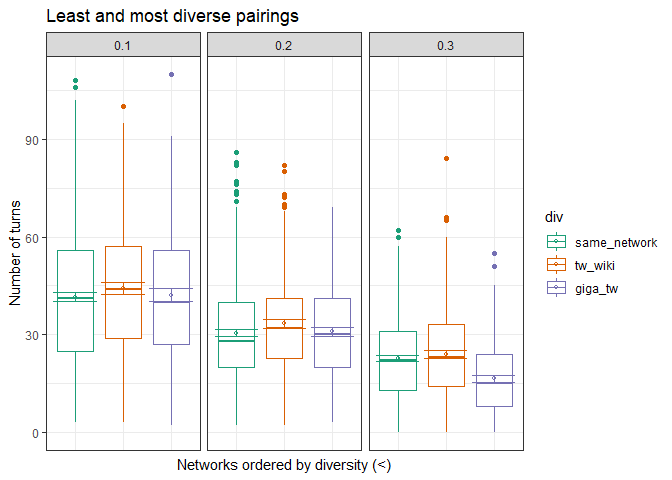

``` r
# load packages and the data
  # load Rmisc (+plyr) first bc otherwise it messes up dplyr
library(Rmisc)
```

    ## Warning: package 'Rmisc' was built under R version 3.6.3

    ## Loading required package: lattice

    ## Loading required package: plyr

    ## Warning: package 'plyr' was built under R version 3.6.3

``` r
pacman::p_load(tidyverse, dplyr, ggplot2, patchwork, RColorBrewer, plotrix, lme4, lmerTest, lmtest, car, AER, jtools)

# set directory
setwd("C:/Users/molna/Desktop/AU/5th_semester/Bachelor")

# load df with pairs
df1 <- read.csv("run_0.1.csv", sep=",")

# load df with individuals
df2 <- read.csv("run_0.1_ind.csv", sep=",")

# rename columns
names(df1)[names(df1) == "X.run.number."] <- "run"
names(df1)[names(df1) == "X.step."] <- "turns"
names(df1)[names(df1) == "words.said"] <- "words said"

names(df2)[names(df2) == "X.run.number."] <- "run"
names(df2)[names(df2) == "X.step."] <- "turns"
names(df2)[names(df2) == "words.said"] <- "words said"

# make person a character (from factor)
df1$person1 <- as.character(df1$person1)
df1$person2 <- as.character(df1$person2)

## simplify person1 & 2 column contents

#for df1
df1$person1[df1$person1 == "animals_gigaword.csv"] <- "gigaword"
df1$person1[df1$person1 == "animals_google.csv"] <- "google"
df1$person1[df1$person1 == "animals_twitter.csv"] <- "twitter"
df1$person1[df1$person1 == "animals_wikipedia.csv"] <- "wiki"

df1$person2[df1$person2 == "animals_gigaword.csv"] <- "gigaword"
df1$person2[df1$person2 == "animals_google.csv"] <- "google"
df1$person2[df1$person2 == "animals_twitter.csv"] <- "twitter"
df1$person2[df1$person2 == "animals_wikipedia.csv"] <- "wiki"

## for df2
df2$person1 <- as.character(df2$person1)
df2$person1[df2$person1 == "animals_gigaword.csv"] <- "gigaword"
df2$person1[df2$person1 == "animals_google.csv"] <- "google"
df2$person1[df2$person1 == "animals_twitter.csv"] <- "twitter"
df2$person1[df2$person1 == "animals_wikipedia.csv"] <- "wiki"

df2$person2 <- NA

df2$div[df2$person1 == "gigaword"] <- "individual"
df2$div[df2$person1 == "google"] <- "individual"
df2$div[df2$person1 == "twitter"] <- "individual"
df2$div[df2$person1 == "wiki"] <- "individual"

# add div (diversity) column for ordinal variable
df1$div <- NA

df1$div[df1$person1 == "gigaword" & df1$person2 == "google" | df1$person1 == "google" & df1$person2 == "gigaword"] <- "giga_google"

df1$div[df1$person1 == "gigaword" & df1$person2 == "twitter" | df1$person1 == "twitter" & df1$person2 == "gigaword"] <- "giga_tw"

df1$div[df1$person1 == "gigaword" & df1$person2 == "wiki" | df1$person1 == "wiki" & df1$person2 == "gigaword"] <- "giga_wiki"

df1$div[df1$person1 == "google" & df1$person2 == "twitter" | df1$person1 == "twitter" & df1$person2 == "google"] <- "google_tw"

df1$div[df1$person1 == "google" & df1$person2 == "wiki" | df1$person1 == "wiki" & df1$person2 == "google"] <- "google_wiki"

df1$div[df1$person1 == "twitter" & df1$person2 == "wiki" | df1$person1 == "wiki" & df1$person2 == "twitter"] <- "tw_wiki"

df1$div[df1$person1 == "gigaword" & df1$person2 == "gigaword"] <- "same_network"
df1$div[df1$person1 == "google" & df1$person2 == "google"] <- "same_network"
df1$div[df1$person1 == "twitter" & df1$person2 == "twitter"] <- "same_network"
df1$div[df1$person1 == "wiki" & df1$person2 == "wiki"] <- "same_network"

# specify ordinal variables with levels
df1$div <- factor(df1$div, order = TRUE, levels = c("same_network", "giga_wiki", "google_wiki", "giga_google", "google_tw", "tw_wiki", "giga_tw"))

# rbind pairs and individuals
df_all <- rbind(df1, df2)

# Specify that they are ordinal variables with the given levels
df_all$div <- factor(df_all$div, order = TRUE, levels = c("individual", "same_network", "giga_wiki", "google_wiki", "giga_google", "google_tw", "tw_wiki", "giga_tw"))
```

``` r
### Test diversity + expertise hypotheses
# H1: performance ~ diversity + network_connectivity
# H2: performance ~ diversity * network_connectivity

# poisson regression bc outcome is count variable
m3 <- glm(turns ~ div * threshold, data = df1, family = poisson)
summary(m3)
```

    ## 
    ## Call:
    ## glm(formula = turns ~ div * threshold, family = poisson, data = df1)
    ## 
    ## Deviance Residuals: 
    ##     Min       1Q   Median       3Q      Max  
    ## -8.4185  -2.3255  -0.2311   1.7825   9.4597  
    ## 
    ## Coefficients:
    ##                  Estimate Std. Error  z value Pr(>|z|)    
    ## (Intercept)      4.129318   0.004592  899.243  < 2e-16 ***
    ## div.L            0.075917   0.011594    6.548 5.83e-11 ***
    ## div.Q           -0.014833   0.011714   -1.266 0.205391    
    ## div.C            0.112041   0.012018    9.323  < 2e-16 ***
    ## div^4            0.030568   0.012475    2.450 0.014270 *  
    ## div^5            0.053719   0.012428    4.323 1.54e-05 ***
    ## div^6           -0.131659   0.012629  -10.425  < 2e-16 ***
    ## threshold       -3.641445   0.023851 -152.675  < 2e-16 ***
    ## div.L:threshold -0.220970   0.060371   -3.660 0.000252 ***
    ## div.Q:threshold -0.062437   0.061236   -1.020 0.307915    
    ## div.C:threshold -1.303589   0.062033  -21.015  < 2e-16 ***
    ## div^4:threshold -0.451849   0.065281   -6.922 4.47e-12 ***
    ## div^5:threshold -0.364386   0.063651   -5.725 1.04e-08 ***
    ## div^6:threshold  1.311917   0.065854   19.921  < 2e-16 ***
    ## ---
    ## Signif. codes:  0 '***' 0.001 '**' 0.01 '*' 0.05 '.' 0.1 ' ' 1
    ## 
    ## (Dispersion parameter for poisson family taken to be 1)
    ## 
    ##     Null deviance: 107807  on 9599  degrees of freedom
    ## Residual deviance:  81580  on 9586  degrees of freedom
    ## AIC: 130093
    ## 
    ## Number of Fisher Scoring iterations: 5

``` r
m4 <- glm(turns ~ div + threshold, data = df1, family = poisson)
summary(m4)
```

    ## 
    ## Call:
    ## glm(formula = turns ~ div + threshold, family = poisson, data = df1)
    ## 
    ## Deviance Residuals: 
    ##     Min       1Q   Median       3Q      Max  
    ## -8.5144  -2.3592  -0.2748   1.7754   9.8270  
    ## 
    ## Coefficients:
    ##              Estimate Std. Error  z value Pr(>|z|)    
    ## (Intercept)  4.109538   0.004480  917.312  < 2e-16 ***
    ## div.L        0.037885   0.004751    7.975 1.53e-15 ***
    ## div.Q       -0.026647   0.004806   -5.544 2.95e-08 ***
    ## div.C       -0.118309   0.004905  -24.120  < 2e-16 ***
    ## div^4       -0.047720   0.005122   -9.317  < 2e-16 ***
    ## div^5       -0.009135   0.005055   -1.807   0.0707 .  
    ## div^6        0.098457   0.005175   19.027  < 2e-16 ***
    ## threshold   -3.519857   0.022976 -153.198  < 2e-16 ***
    ## ---
    ## Signif. codes:  0 '***' 0.001 '**' 0.01 '*' 0.05 '.' 0.1 ' ' 1
    ## 
    ## (Dispersion parameter for poisson family taken to be 1)
    ## 
    ##     Null deviance: 107807  on 9599  degrees of freedom
    ## Residual deviance:  82527  on 9592  degrees of freedom
    ## AIC: 131028
    ## 
    ## Number of Fisher Scoring iterations: 5

``` r
######################################

### check for overdispersion (if variance is considerably bigger than the mean)

mean(df1$turns[df1$div == "giga_wiki"])
```

    ## [1] 29.58667

``` r
var(df1$turns[df1$div == "giga_wiki"])
```

    ## [1] 340.9149

``` r
# from tutorial
plot(log(fitted(m4)),log((df1$turns-fitted(m4))^2),xlab=expression(hat(mu)),ylab=expression((y-hat(mu))^2),pch=20,col="blue") +
  abline(0,1) ## 'variance = mean' line
```



    ## integer(0)

``` r
dp = sum(residuals(m4,type ="pearson")^2)/m4$df.residual
dp
```

    ## [1] 8.191893

``` r
dispersiontest(m3)
```

    ## 
    ##  Overdispersion test
    ## 
    ## data:  m3
    ## z = 64.42, p-value < 2.2e-16
    ## alternative hypothesis: true dispersion is greater than 1
    ## sample estimates:
    ## dispersion 
    ##   8.086252

``` r
summary(m4,dispersion = dp)
```

    ## 
    ## Call:
    ## glm(formula = turns ~ div + threshold, family = poisson, data = df1)
    ## 
    ## Deviance Residuals: 
    ##     Min       1Q   Median       3Q      Max  
    ## -8.5144  -2.3592  -0.2748   1.7754   9.8270  
    ## 
    ## Coefficients:
    ##              Estimate Std. Error z value Pr(>|z|)    
    ## (Intercept)  4.109538   0.012822 320.498  < 2e-16 ***
    ## div.L        0.037885   0.013597   2.786  0.00533 ** 
    ## div.Q       -0.026647   0.013756  -1.937  0.05273 .  
    ## div.C       -0.118309   0.014039  -8.427  < 2e-16 ***
    ## div^4       -0.047720   0.014660  -3.255  0.00113 ** 
    ## div^5       -0.009135   0.014467  -0.631  0.52778    
    ## div^6        0.098457   0.014811   6.648 2.98e-11 ***
    ## threshold   -3.519857   0.065760 -53.525  < 2e-16 ***
    ## ---
    ## Signif. codes:  0 '***' 0.001 '**' 0.01 '*' 0.05 '.' 0.1 ' ' 1
    ## 
    ## (Dispersion parameter for poisson family taken to be 8.191893)
    ## 
    ##     Null deviance: 107807  on 9599  degrees of freedom
    ## Residual deviance:  82527  on 9592  degrees of freedom
    ## AIC: 131028
    ## 
    ## Number of Fisher Scoring iterations: 5

``` r
# use quasi-Poisson instead of poisson bc of overdispersion

m3_qpoi = glm(turns ~ div * threshold, data = df1, family = quasipoisson)
summary(m3_qpoi)
```

    ## 
    ## Call:
    ## glm(formula = turns ~ div * threshold, family = quasipoisson, 
    ##     data = df1)
    ## 
    ## Deviance Residuals: 
    ##     Min       1Q   Median       3Q      Max  
    ## -8.4185  -2.3255  -0.2311   1.7825   9.4597  
    ## 
    ## Coefficients:
    ##                 Estimate Std. Error t value Pr(>|t|)    
    ## (Intercept)      4.12932    0.01307 316.024  < 2e-16 ***
    ## div.L            0.07592    0.03299   2.301  0.02140 *  
    ## div.Q           -0.01483    0.03333  -0.445  0.65631    
    ## div.C            0.11204    0.03420   3.276  0.00106 ** 
    ## div^4            0.03057    0.03550   0.861  0.38918    
    ## div^5            0.05372    0.03536   1.519  0.12877    
    ## div^6           -0.13166    0.03594  -3.664  0.00025 ***
    ## threshold       -3.64144    0.06787 -53.655  < 2e-16 ***
    ## div.L:threshold -0.22097    0.17179  -1.286  0.19837    
    ## div.Q:threshold -0.06244    0.17425  -0.358  0.72011    
    ## div.C:threshold -1.30359    0.17651  -7.385 1.65e-13 ***
    ## div^4:threshold -0.45185    0.18576  -2.432  0.01501 *  
    ## div^5:threshold -0.36439    0.18112  -2.012  0.04426 *  
    ## div^6:threshold  1.31192    0.18739   7.001 2.71e-12 ***
    ## ---
    ## Signif. codes:  0 '***' 0.001 '**' 0.01 '*' 0.05 '.' 0.1 ' ' 1
    ## 
    ## (Dispersion parameter for quasipoisson family taken to be 8.096826)
    ## 
    ##     Null deviance: 107807  on 9599  degrees of freedom
    ## Residual deviance:  81580  on 9586  degrees of freedom
    ## AIC: NA
    ## 
    ## Number of Fisher Scoring iterations: 5

``` r
m5_qpoi = glm(turns ~ div + threshold, data = df1, family = quasipoisson(link = "log"))
summary(m5_qpoi)
```

    ## 
    ## Call:
    ## glm(formula = turns ~ div + threshold, family = quasipoisson(link = "log"), 
    ##     data = df1)
    ## 
    ## Deviance Residuals: 
    ##     Min       1Q   Median       3Q      Max  
    ## -8.5144  -2.3592  -0.2748   1.7754   9.8270  
    ## 
    ## Coefficients:
    ##              Estimate Std. Error t value Pr(>|t|)    
    ## (Intercept)  4.109538   0.012822 320.498  < 2e-16 ***
    ## div.L        0.037885   0.013597   2.786  0.00534 ** 
    ## div.Q       -0.026647   0.013756  -1.937  0.05276 .  
    ## div.C       -0.118309   0.014039  -8.427  < 2e-16 ***
    ## div^4       -0.047720   0.014660  -3.255  0.00114 ** 
    ## div^5       -0.009135   0.014467  -0.631  0.52779    
    ## div^6        0.098457   0.014811   6.648 3.14e-11 ***
    ## threshold   -3.519857   0.065760 -53.525  < 2e-16 ***
    ## ---
    ## Signif. codes:  0 '***' 0.001 '**' 0.01 '*' 0.05 '.' 0.1 ' ' 1
    ## 
    ## (Dispersion parameter for quasipoisson family taken to be 8.191893)
    ## 
    ##     Null deviance: 107807  on 9599  degrees of freedom
    ## Residual deviance:  82527  on 9592  degrees of freedom
    ## AIC: NA
    ## 
    ## Number of Fisher Scoring iterations: 5

``` r
summary(m3_qpoi)
```

    ## 
    ## Call:
    ## glm(formula = turns ~ div * threshold, family = quasipoisson, 
    ##     data = df1)
    ## 
    ## Deviance Residuals: 
    ##     Min       1Q   Median       3Q      Max  
    ## -8.4185  -2.3255  -0.2311   1.7825   9.4597  
    ## 
    ## Coefficients:
    ##                 Estimate Std. Error t value Pr(>|t|)    
    ## (Intercept)      4.12932    0.01307 316.024  < 2e-16 ***
    ## div.L            0.07592    0.03299   2.301  0.02140 *  
    ## div.Q           -0.01483    0.03333  -0.445  0.65631    
    ## div.C            0.11204    0.03420   3.276  0.00106 ** 
    ## div^4            0.03057    0.03550   0.861  0.38918    
    ## div^5            0.05372    0.03536   1.519  0.12877    
    ## div^6           -0.13166    0.03594  -3.664  0.00025 ***
    ## threshold       -3.64144    0.06787 -53.655  < 2e-16 ***
    ## div.L:threshold -0.22097    0.17179  -1.286  0.19837    
    ## div.Q:threshold -0.06244    0.17425  -0.358  0.72011    
    ## div.C:threshold -1.30359    0.17651  -7.385 1.65e-13 ***
    ## div^4:threshold -0.45185    0.18576  -2.432  0.01501 *  
    ## div^5:threshold -0.36439    0.18112  -2.012  0.04426 *  
    ## div^6:threshold  1.31192    0.18739   7.001 2.71e-12 ***
    ## ---
    ## Signif. codes:  0 '***' 0.001 '**' 0.01 '*' 0.05 '.' 0.1 ' ' 1
    ## 
    ## (Dispersion parameter for quasipoisson family taken to be 8.096826)
    ## 
    ##     Null deviance: 107807  on 9599  degrees of freedom
    ## Residual deviance:  81580  on 9586  degrees of freedom
    ## AIC: NA
    ## 
    ## Number of Fisher Scoring iterations: 5

``` r
# 8.191893 dispersion -> variance of the random component is much bigger than the mean -> still indicates poor model fit

# get odds ratios
# summ(m5_qpoi) # get only beta values
summ(m5_qpoi, exp = TRUE) # get odds ratios instead of the beta estimate
```

    ## Note: Pseudo-R2 for quasibinomial/quasipoisson families is calculated by
    ## refitting the fitted and null models as binomial/poisson.

<table class="table table-striped table-hover table-condensed table-responsive" style="width: auto !important; margin-left: auto; margin-right: auto;">
<tbody>
<tr>
<td style="text-align:left;font-weight: bold;">
Observations
</td>
<td style="text-align:right;">
9600
</td>
</tr>
<tr>
<td style="text-align:left;font-weight: bold;">
Dependent variable
</td>
<td style="text-align:right;">
turns
</td>
</tr>
<tr>
<td style="text-align:left;font-weight: bold;">
Type
</td>
<td style="text-align:right;">
Generalized linear model
</td>
</tr>
<tr>
<td style="text-align:left;font-weight: bold;">
Family
</td>
<td style="text-align:right;">
quasipoisson
</td>
</tr>
<tr>
<td style="text-align:left;font-weight: bold;">
Link
</td>
<td style="text-align:right;">
log
</td>
</tr>
</tbody>
</table>
<table class="table table-striped table-hover table-condensed table-responsive" style="width: auto !important; margin-left: auto; margin-right: auto;">
<tbody>
<tr>
<td style="text-align:left;font-weight: bold;">
χ²(7)
</td>
<td style="text-align:right;">
25280.19
</td>
</tr>
<tr>
<td style="text-align:left;font-weight: bold;">
Pseudo-R² (Cragg-Uhler)
</td>
<td style="text-align:right;">
0.93
</td>
</tr>
<tr>
<td style="text-align:left;font-weight: bold;">
Pseudo-R² (McFadden)
</td>
<td style="text-align:right;">
0.16
</td>
</tr>
<tr>
<td style="text-align:left;font-weight: bold;">
AIC
</td>
<td style="text-align:right;">
NA
</td>
</tr>
<tr>
<td style="text-align:left;font-weight: bold;">
BIC
</td>
<td style="text-align:right;">
NA
</td>
</tr>
</tbody>
</table>
<table class="table table-striped table-hover table-condensed table-responsive" style="width: auto !important; margin-left: auto; margin-right: auto;">
<thead>
<tr>
<th style="text-align:left;">
</th>
<th style="text-align:right;">
exp(Est.)
</th>
<th style="text-align:right;">
2.5%
</th>
<th style="text-align:right;">
97.5%
</th>
<th style="text-align:right;">
t val.
</th>
<th style="text-align:right;">
p
</th>
</tr>
</thead>
<tbody>
<tr>
<td style="text-align:left;font-weight: bold;">
(Intercept)
</td>
<td style="text-align:right;">
60.92
</td>
<td style="text-align:right;">
59.41
</td>
<td style="text-align:right;">
62.47
</td>
<td style="text-align:right;">
320.50
</td>
<td style="text-align:right;">
0.00
</td>
</tr>
<tr>
<td style="text-align:left;font-weight: bold;">
div.L
</td>
<td style="text-align:right;">
1.04
</td>
<td style="text-align:right;">
1.01
</td>
<td style="text-align:right;">
1.07
</td>
<td style="text-align:right;">
2.79
</td>
<td style="text-align:right;">
0.01
</td>
</tr>
<tr>
<td style="text-align:left;font-weight: bold;">
div.Q
</td>
<td style="text-align:right;">
0.97
</td>
<td style="text-align:right;">
0.95
</td>
<td style="text-align:right;">
1.00
</td>
<td style="text-align:right;">
-1.94
</td>
<td style="text-align:right;">
0.05
</td>
</tr>
<tr>
<td style="text-align:left;font-weight: bold;">
div.C
</td>
<td style="text-align:right;">
0.89
</td>
<td style="text-align:right;">
0.86
</td>
<td style="text-align:right;">
0.91
</td>
<td style="text-align:right;">
-8.43
</td>
<td style="text-align:right;">
0.00
</td>
</tr>
<tr>
<td style="text-align:left;font-weight: bold;">
div^4
</td>
<td style="text-align:right;">
0.95
</td>
<td style="text-align:right;">
0.93
</td>
<td style="text-align:right;">
0.98
</td>
<td style="text-align:right;">
-3.26
</td>
<td style="text-align:right;">
0.00
</td>
</tr>
<tr>
<td style="text-align:left;font-weight: bold;">
div^5
</td>
<td style="text-align:right;">
0.99
</td>
<td style="text-align:right;">
0.96
</td>
<td style="text-align:right;">
1.02
</td>
<td style="text-align:right;">
-0.63
</td>
<td style="text-align:right;">
0.53
</td>
</tr>
<tr>
<td style="text-align:left;font-weight: bold;">
div^6
</td>
<td style="text-align:right;">
1.10
</td>
<td style="text-align:right;">
1.07
</td>
<td style="text-align:right;">
1.14
</td>
<td style="text-align:right;">
6.65
</td>
<td style="text-align:right;">
0.00
</td>
</tr>
<tr>
<td style="text-align:left;font-weight: bold;">
threshold
</td>
<td style="text-align:right;">
0.03
</td>
<td style="text-align:right;">
0.03
</td>
<td style="text-align:right;">
0.03
</td>
<td style="text-align:right;">
-53.53
</td>
<td style="text-align:right;">
0.00
</td>
</tr>
</tbody>
<tfoot>
<tr>
<td style="padding: 0; border: 0;" colspan="100%">
<sup></sup> Standard errors: MLE
</td>
</tr>
</tfoot>
</table>

``` r
summ(m3_qpoi, exp = TRUE)
```

    ## Note: Pseudo-R2 for quasibinomial/quasipoisson families is calculated by
    ## refitting the fitted and null models as binomial/poisson.

<table class="table table-striped table-hover table-condensed table-responsive" style="width: auto !important; margin-left: auto; margin-right: auto;">
<tbody>
<tr>
<td style="text-align:left;font-weight: bold;">
Observations
</td>
<td style="text-align:right;">
9600
</td>
</tr>
<tr>
<td style="text-align:left;font-weight: bold;">
Dependent variable
</td>
<td style="text-align:right;">
turns
</td>
</tr>
<tr>
<td style="text-align:left;font-weight: bold;">
Type
</td>
<td style="text-align:right;">
Generalized linear model
</td>
</tr>
<tr>
<td style="text-align:left;font-weight: bold;">
Family
</td>
<td style="text-align:right;">
quasipoisson
</td>
</tr>
<tr>
<td style="text-align:left;font-weight: bold;">
Link
</td>
<td style="text-align:right;">
log
</td>
</tr>
</tbody>
</table>
<table class="table table-striped table-hover table-condensed table-responsive" style="width: auto !important; margin-left: auto; margin-right: auto;">
<tbody>
<tr>
<td style="text-align:left;font-weight: bold;">
χ²(13)
</td>
<td style="text-align:right;">
26227.69
</td>
</tr>
<tr>
<td style="text-align:left;font-weight: bold;">
Pseudo-R² (Cragg-Uhler)
</td>
<td style="text-align:right;">
0.93
</td>
</tr>
<tr>
<td style="text-align:left;font-weight: bold;">
Pseudo-R² (McFadden)
</td>
<td style="text-align:right;">
0.17
</td>
</tr>
<tr>
<td style="text-align:left;font-weight: bold;">
AIC
</td>
<td style="text-align:right;">
NA
</td>
</tr>
<tr>
<td style="text-align:left;font-weight: bold;">
BIC
</td>
<td style="text-align:right;">
NA
</td>
</tr>
</tbody>
</table>
<table class="table table-striped table-hover table-condensed table-responsive" style="width: auto !important; margin-left: auto; margin-right: auto;">
<thead>
<tr>
<th style="text-align:left;">
</th>
<th style="text-align:right;">
exp(Est.)
</th>
<th style="text-align:right;">
2.5%
</th>
<th style="text-align:right;">
97.5%
</th>
<th style="text-align:right;">
t val.
</th>
<th style="text-align:right;">
p
</th>
</tr>
</thead>
<tbody>
<tr>
<td style="text-align:left;font-weight: bold;">
(Intercept)
</td>
<td style="text-align:right;">
62.14
</td>
<td style="text-align:right;">
60.56
</td>
<td style="text-align:right;">
63.75
</td>
<td style="text-align:right;">
316.02
</td>
<td style="text-align:right;">
0.00
</td>
</tr>
<tr>
<td style="text-align:left;font-weight: bold;">
div.L
</td>
<td style="text-align:right;">
1.08
</td>
<td style="text-align:right;">
1.01
</td>
<td style="text-align:right;">
1.15
</td>
<td style="text-align:right;">
2.30
</td>
<td style="text-align:right;">
0.02
</td>
</tr>
<tr>
<td style="text-align:left;font-weight: bold;">
div.Q
</td>
<td style="text-align:right;">
0.99
</td>
<td style="text-align:right;">
0.92
</td>
<td style="text-align:right;">
1.05
</td>
<td style="text-align:right;">
-0.45
</td>
<td style="text-align:right;">
0.66
</td>
</tr>
<tr>
<td style="text-align:left;font-weight: bold;">
div.C
</td>
<td style="text-align:right;">
1.12
</td>
<td style="text-align:right;">
1.05
</td>
<td style="text-align:right;">
1.20
</td>
<td style="text-align:right;">
3.28
</td>
<td style="text-align:right;">
0.00
</td>
</tr>
<tr>
<td style="text-align:left;font-weight: bold;">
div^4
</td>
<td style="text-align:right;">
1.03
</td>
<td style="text-align:right;">
0.96
</td>
<td style="text-align:right;">
1.11
</td>
<td style="text-align:right;">
0.86
</td>
<td style="text-align:right;">
0.39
</td>
</tr>
<tr>
<td style="text-align:left;font-weight: bold;">
div^5
</td>
<td style="text-align:right;">
1.06
</td>
<td style="text-align:right;">
0.98
</td>
<td style="text-align:right;">
1.13
</td>
<td style="text-align:right;">
1.52
</td>
<td style="text-align:right;">
0.13
</td>
</tr>
<tr>
<td style="text-align:left;font-weight: bold;">
div^6
</td>
<td style="text-align:right;">
0.88
</td>
<td style="text-align:right;">
0.82
</td>
<td style="text-align:right;">
0.94
</td>
<td style="text-align:right;">
-3.66
</td>
<td style="text-align:right;">
0.00
</td>
</tr>
<tr>
<td style="text-align:left;font-weight: bold;">
threshold
</td>
<td style="text-align:right;">
0.03
</td>
<td style="text-align:right;">
0.02
</td>
<td style="text-align:right;">
0.03
</td>
<td style="text-align:right;">
-53.66
</td>
<td style="text-align:right;">
0.00
</td>
</tr>
<tr>
<td style="text-align:left;font-weight: bold;">
div.L:threshold
</td>
<td style="text-align:right;">
0.80
</td>
<td style="text-align:right;">
0.57
</td>
<td style="text-align:right;">
1.12
</td>
<td style="text-align:right;">
-1.29
</td>
<td style="text-align:right;">
0.20
</td>
</tr>
<tr>
<td style="text-align:left;font-weight: bold;">
div.Q:threshold
</td>
<td style="text-align:right;">
0.94
</td>
<td style="text-align:right;">
0.67
</td>
<td style="text-align:right;">
1.32
</td>
<td style="text-align:right;">
-0.36
</td>
<td style="text-align:right;">
0.72
</td>
</tr>
<tr>
<td style="text-align:left;font-weight: bold;">
div.C:threshold
</td>
<td style="text-align:right;">
0.27
</td>
<td style="text-align:right;">
0.19
</td>
<td style="text-align:right;">
0.38
</td>
<td style="text-align:right;">
-7.39
</td>
<td style="text-align:right;">
0.00
</td>
</tr>
<tr>
<td style="text-align:left;font-weight: bold;">
div^4:threshold
</td>
<td style="text-align:right;">
0.64
</td>
<td style="text-align:right;">
0.44
</td>
<td style="text-align:right;">
0.92
</td>
<td style="text-align:right;">
-2.43
</td>
<td style="text-align:right;">
0.02
</td>
</tr>
<tr>
<td style="text-align:left;font-weight: bold;">
div^5:threshold
</td>
<td style="text-align:right;">
0.69
</td>
<td style="text-align:right;">
0.49
</td>
<td style="text-align:right;">
0.99
</td>
<td style="text-align:right;">
-2.01
</td>
<td style="text-align:right;">
0.04
</td>
</tr>
<tr>
<td style="text-align:left;font-weight: bold;">
div^6:threshold
</td>
<td style="text-align:right;">
3.71
</td>
<td style="text-align:right;">
2.57
</td>
<td style="text-align:right;">
5.36
</td>
<td style="text-align:right;">
7.00
</td>
<td style="text-align:right;">
0.00
</td>
</tr>
</tbody>
<tfoot>
<tr>
<td style="padding: 0; border: 0;" colspan="100%">
<sup></sup> Standard errors: MLE
</td>
</tr>
</tfoot>
</table>

``` r
anova(m5_qpoi, m3_qpoi, test = "Chisq") # interaction model is supposedly better
```

    ## Analysis of Deviance Table
    ## 
    ## Model 1: turns ~ div + threshold
    ## Model 2: turns ~ div * threshold
    ##   Resid. Df Resid. Dev Df Deviance  Pr(>Chi)    
    ## 1      9592      82527                          
    ## 2      9586      81580  6   947.49 < 2.2e-16 ***
    ## ---
    ## Signif. codes:  0 '***' 0.001 '**' 0.01 '*' 0.05 '.' 0.1 ' ' 1

``` r
## filtering network pairs for future use & descriptive statistics

# Gigaword-Google pairs
giga_google <- filter(df1, div == "giga_google")

giga_google_stats <- giga_google%>% group_by(threshold) %>%
  summarise(mean(turns),
            max(turns),
            min(turns),
            var(turns))

# change the names
names(giga_google_stats)[names(giga_google_stats) == "mean(turns)"] <- "mean_turns"
names(giga_google_stats)[names(giga_google_stats) == "max(turns)"] <- "max_turns"
names(giga_google_stats)[names(giga_google_stats) == "min(turns)"] <- "min_turns"
names(giga_google_stats)[names(giga_google_stats) == "var(turns)"] <- "var_turns"

# calculate 95% CIs
#t.test(giga_google_stats$turns[giga_google_stats$threshold == 0.1], conf.level = 0.95) # 39.95183 44.31317
#t.test(giga_google_stats$turns[giga_google_stats$threshold == 0.2], conf.level = 0.95) # 27.98358 30.71142
#t.test(giga_google_stats$turns[giga_google_stats$threshold == 0.3], conf.level = 0.95) # 14.70309 16.84691

# add CIs to table
giga_google_stats$CI_lower <- c(39.95183, 27.98358, 14.70309)
giga_google_stats$CI_upper <- c(44.31317, 30.71142, 16.84691)

# add condition column
giga_google_stats$sem_netw <- c("giga_google", "giga_google", "giga_google")


# Gigaword-Twitter pairs
giga_tw <- filter(df1, div == "giga_tw")

giga_tw_stats <- giga_tw%>% group_by(threshold) %>%
  summarise(mean(turns),
            max(turns),
            min(turns),
            var(turns))

# change the names
names(giga_tw_stats)[names(giga_tw_stats) == "mean(turns)"] <- "mean_turns"
names(giga_tw_stats)[names(giga_tw_stats) == "max(turns)"] <- "max_turns"
names(giga_tw_stats)[names(giga_tw_stats) == "min(turns)"] <- "min_turns"
names(giga_tw_stats)[names(giga_tw_stats) == "var(turns)"] <- "var_turns"

# calculate 95% CIs
#t.test(giga_tw$turns[giga_tw$threshold == 0.1], conf.level = 0.95) # 40.19754 44.07246
#t.test(giga_tw$turns[giga_tw$threshold == 0.2], conf.level = 0.95) # 29.43768 32.36232
#t.test(giga_tw$turns[giga_tw$threshold == 0.3], conf.level = 0.95) # 15.36736 17.59264

# add CIs to table
giga_tw_stats$CI_lower <- c(40.19754, 29.43768, 15.36736)
giga_tw_stats$CI_upper <- c(44.07246, 32.36232, 17.59264)

giga_tw_stats$sem_netw <- c("giga_tw","giga_tw","giga_tw")


# Gigaword-Wikipedia pairs
giga_wiki <- filter(df1, div == "giga_wiki")

giga_wiki_stats <- giga_wiki%>% group_by(threshold) %>%
  summarise(mean(turns),
            max(turns),
            min(turns),
            var(turns))

# change the names
names(giga_wiki_stats)[names(giga_wiki_stats) == "mean(turns)"] <- "mean_turns"
names(giga_wiki_stats)[names(giga_wiki_stats) == "max(turns)"] <- "max_turns"
names(giga_wiki_stats)[names(giga_wiki_stats) == "min(turns)"] <- "min_turns"
names(giga_wiki_stats)[names(giga_wiki_stats) == "var(turns)"] <- "var_turns"

# calculate 95% CIs
#t.test(giga_wiki$turns[giga_wiki$threshold == 0.1], conf.level = 0.95) # 39.51353 43.54647
#t.test(giga_wiki$turns[giga_wiki$threshold == 0.2], conf.level = 0.95) # 28.82374 31.45126
#t.test(giga_wiki$turns[giga_wiki$threshold == 0.3], conf.level = 0.95) # 15.99267 18.19233

# add CIs to table
giga_wiki_stats$CI_lower <- c(39.51353, 28.82374, 15.99267)
giga_wiki_stats$CI_upper <- c(43.54647, 31.45126, 18.19233)

giga_wiki_stats$sem_netw <- c("giga_wiki", "giga_wiki", "giga_wiki")


# Google-Twitter pairs
google_tw <- filter(df1, div == "google_tw")
google_tw_stats <- google_tw%>% group_by(threshold) %>%
  summarise(mean(turns),
            max(turns),
            min(turns),
            var(turns))

# change the names
names(google_tw_stats)[names(google_tw_stats) == "mean(turns)"] <- "mean_turns"
names(google_tw_stats)[names(google_tw_stats) == "max(turns)"] <- "max_turns"
names(google_tw_stats)[names(google_tw_stats) == "min(turns)"] <- "min_turns"
names(google_tw_stats)[names(google_tw_stats) == "var(turns)"] <- "var_turns"

# calculate 95% CIs
#t.test(google_tw$turns[google_tw$threshold == 0.1], conf.level = 0.95) # 43.01477 47.15523
#t.test(google_tw$turns[google_tw$threshold == 0.2], conf.level = 0.95) # 31.59648 34.43352
#t.test(google_tw$turns[google_tw$threshold == 0.3], conf.level = 0.95) # 25.01068 27.74932

# add CIs to table
google_tw_stats$CI_lower <- c(43.01477, 31.59648, 25.01068)
google_tw_stats$CI_upper <- c(47.15523, 34.43352, 27.74932)

# add column with condition
google_tw_stats$sem_netw <- c("google_tw", "google_tw", "google_tw")


# Google-Wikipedia pairs

google_wiki <- filter(df1, div == "google_wiki")

google_wiki_stats <- google_wiki%>% group_by(threshold) %>%
  summarise(mean(turns),
            max(turns),
            min(turns),
            var(turns))

# change the names
names(google_wiki_stats)[names(google_wiki_stats) == "mean(turns)"] <- "mean_turns"
names(google_wiki_stats)[names(google_wiki_stats) == "max(turns)"] <- "max_turns"
names(google_wiki_stats)[names(google_wiki_stats) == "min(turns)"] <- "min_turns"
names(google_wiki_stats)[names(google_wiki_stats) == "var(turns)"] <- "var_turns"

# calculate 95% CIs
#t.test(google_wiki$turns[google_wiki$threshold == 0.1], conf.level = 0.95) # 39.56626 43.42874
#t.test(google_wiki$turns[google_wiki$threshold == 0.2], conf.level = 0.95) # 30.3324 33.4126
#t.test(google_wiki$turns[google_wiki$threshold == 0.3], conf.level = 0.95) # 19.89314 22.26186

# add CIs to table
google_wiki_stats$CI_lower <- c(39.56626, 30.3324, 19.89314)
google_wiki_stats$CI_upper <- c(43.42874, 33.4126, 22.26186)

# add condition_column
google_wiki_stats$sem_netw <- c("google_wiki", "google_wiki", "google_wiki")


# Twitter-Wikipedia pairs
tw_wiki <- filter(df1, div == "tw_wiki")
tw_wiki_stats <- tw_wiki%>% group_by(threshold) %>%
  summarise(mean(turns),
            max(turns),
            min(turns),
            var(turns))

# change the names
names(tw_wiki_stats)[names(tw_wiki_stats) == "mean(turns)"] <- "mean_turns"
names(tw_wiki_stats)[names(tw_wiki_stats) == "max(turns)"] <- "max_turns"
names(tw_wiki_stats)[names(tw_wiki_stats) == "min(turns)"] <- "min_turns"
names(tw_wiki_stats)[names(tw_wiki_stats) == "var(turns)"] <- "var_turns"

# calculate 95% CIs
#t.test(tw_wiki$turns[tw_wiki$threshold == 0.1], conf.level = 0.95) # 42.21524 46.09976
#t.test(tw_wiki$turns[tw_wiki$threshold == 0.2], conf.level = 0.95) # 31.85817 34.78183
#t.test(tw_wiki$turns[tw_wiki$threshold == 0.3], conf.level = 0.95) # 22.58642 25.27358

# add CIs to table
tw_wiki_stats$CI_lower <- c(42.21524, 31.85817, 22.58642)
tw_wiki_stats$CI_upper <- c(46.09976, 34.78183, 25.27358)

# add column with condition
tw_wiki_stats$sem_netw <- c("tw_wiki", "tw_wiki", "tw_wiki")

# combine all diff pair combinations
all <- rbind(giga_google_stats, giga_tw_stats, giga_wiki_stats, google_tw_stats, google_wiki_stats, tw_wiki_stats)


# Same-network pairs
same_n <- filter(df1, div == "same_network")

same_n_stats <- same_n%>% group_by(threshold) %>%
  summarise(mean(turns),
            max(turns),
            min(turns),
            var(turns))

# change the names
names(same_n_stats)[names(same_n_stats) == "mean(turns)"] <- "mean_turns"
names(same_n_stats)[names(same_n_stats) == "max(turns)"] <- "max_turns"
names(same_n_stats)[names(same_n_stats) == "min(turns)"] <- "min_turns"
names(same_n_stats)[names(same_n_stats) == "var(turns)"] <- "var_turns"

# calculate 95% CIs
t.test(same_n$turns[same_n$threshold == 0.1], conf.level = 0.95) # 40.09577 42.93923
```

    ## 
    ##  One Sample t-test
    ## 
    ## data:  same_n$turns[same_n$threshold == 0.1]
    ## t = 57.322, df = 799, p-value < 2.2e-16
    ## alternative hypothesis: true mean is not equal to 0
    ## 95 percent confidence interval:
    ##  40.09577 42.93923
    ## sample estimates:
    ## mean of x 
    ##   41.5175

``` r
t.test(same_n$turns[same_n$threshold == 0.2], conf.level = 0.95) # 29.46835 31.56665
```

    ## 
    ##  One Sample t-test
    ## 
    ## data:  same_n$turns[same_n$threshold == 0.2]
    ## t = 57.098, df = 799, p-value < 2.2e-16
    ## alternative hypothesis: true mean is not equal to 0
    ## 95 percent confidence interval:
    ##  29.46835 31.56665
    ## sample estimates:
    ## mean of x 
    ##   30.5175

``` r
t.test(same_n$turns[same_n$threshold == 0.3], conf.level = 0.95) # 21.70625 23.49625
```

    ## 
    ##  One Sample t-test
    ## 
    ## data:  same_n$turns[same_n$threshold == 0.3]
    ## t = 49.57, df = 799, p-value < 2.2e-16
    ## alternative hypothesis: true mean is not equal to 0
    ## 95 percent confidence interval:
    ##  21.70625 23.49625
    ## sample estimates:
    ## mean of x 
    ##  22.60125

``` r
# add CIs to table
same_n_stats$CI_lower <- c(40.09577, 29.46835, 21.70625)
same_n_stats$CI_upper <- c(42.93923, 31.56665, 23.49625)

# add column with condition
same_n_stats$sem_netw <- c("same_network", "same_network", "same_network")


# Individuals
ind_stats <- df2%>% group_by(threshold) %>%
  summarise(mean(turns),
            max(turns),
            min(turns),
            var(turns))

# change the names
names(ind_stats)[names(ind_stats) == "mean(turns)"] <- "mean_turns"
names(ind_stats)[names(ind_stats) == "max(turns)"] <- "max_turns"
names(ind_stats)[names(ind_stats) == "min(turns)"] <- "min_turns"
names(ind_stats)[names(ind_stats) == "var(turns)"] <- "var_turns"

# calculate 95% CIs
t.test(df2$turns[df2$threshold == 0.1], conf.level = 0.95) # 19.87783 21.25967
```

    ## 
    ##  One Sample t-test
    ## 
    ## data:  df2$turns[df2$threshold == 0.1]
    ## t = 58.437, df = 799, p-value < 2.2e-16
    ## alternative hypothesis: true mean is not equal to 0
    ## 95 percent confidence interval:
    ##  19.87783 21.25967
    ## sample estimates:
    ## mean of x 
    ##  20.56875

``` r
t.test(df2$turns[df2$threshold == 0.2], conf.level = 0.95) # 19.61986 20.99264
```

    ## 
    ##  One Sample t-test
    ## 
    ## data:  df2$turns[df2$threshold == 0.2]
    ## t = 58.072, df = 799, p-value < 2.2e-16
    ## alternative hypothesis: true mean is not equal to 0
    ## 95 percent confidence interval:
    ##  19.61986 20.99264
    ## sample estimates:
    ## mean of x 
    ##  20.30625

``` r
t.test(df2$turns[df2$threshold == 0.3], conf.level = 0.95) # 15.7123 16.9552
```

    ## 
    ##  One Sample t-test
    ## 
    ## data:  df2$turns[df2$threshold == 0.3]
    ## t = 51.592, df = 799, p-value < 2.2e-16
    ## alternative hypothesis: true mean is not equal to 0
    ## 95 percent confidence interval:
    ##  15.7123 16.9552
    ## sample estimates:
    ## mean of x 
    ##  16.33375

``` r
# add CIs to table
ind_stats$CI_lower <- c(19.87783, 19.61986, 15.7123)
ind_stats$CI_upper <- c(21.25967, 20.99264, 16.9552)

# add column with condition
ind_stats$sem_netw <- c("individual", "individual", "individual")


# rbind them together
a <- rbind(all, same_n_stats)
b <- rbind(a, ind_stats)
names(b)[names(b) == "sem_netw"] <- "div"

# save them in a table
write.table(b, "descr_stats.csv", sep = ",")
```

``` r
# CIs for df1

# same-network
df1$CI_lower[df1$threshold == 0.1 & df1$div == "same_network"] <- b$CI_lower[b$threshold == 0.1 & b$div == "same_network"]
df1$CI_upper[df1$threshold == 0.1 & df1$div == "same_network"] <- b$CI_upper[b$threshold == 0.1 & b$div == "same_network"]
df1$CI_lower[df1$threshold == 0.2 & df1$div == "same_network"] <- b$CI_lower[b$threshold == 0.2 & b$div == "same_network"]
df1$CI_upper[df1$threshold == 0.2 & df1$div == "same_network"] <- b$CI_upper[b$threshold == 0.2 & b$div == "same_network"]
df1$CI_lower[df1$threshold == 0.3 & df1$div == "same_network"] <- b$CI_lower[b$threshold == 0.3 & b$div == "same_network"]
df1$CI_upper[df1$threshold == 0.3 & df1$div == "same_network"] <- b$CI_upper[b$threshold == 0.3 & b$div == "same_network"]

# gigaword-google
df1$CI_lower[df1$threshold == 0.1 & df1$div == "giga_google"] <- b$CI_lower[b$threshold == 0.1 & b$div == "giga_google"]
df1$CI_upper[df1$threshold == 0.1 & df1$div == "giga_google"] <- b$CI_upper[b$threshold == 0.1 & b$div == "giga_google"]
df1$CI_lower[df1$threshold == 0.2 & df1$div == "giga_google"] <- b$CI_lower[b$threshold == 0.2 & b$div == "giga_google"]
df1$CI_upper[df1$threshold == 0.2 & df1$div == "giga_google"] <- b$CI_upper[b$threshold == 0.2 & b$div == "giga_google"]
df1$CI_lower[df1$threshold == 0.3 & df1$div == "giga_google"] <- b$CI_lower[b$threshold == 0.3 & b$div == "giga_google"]
df1$CI_upper[df1$threshold == 0.3 & df1$div == "giga_google"] <- b$CI_upper[b$threshold == 0.3 & b$div == "giga_google"]

# gigaword-twitter
df1$CI_lower[df1$threshold == 0.1 & df1$div == "giga_tw"] <- b$CI_lower[b$threshold == 0.1 & b$div == "giga_tw"]
df1$CI_upper[df1$threshold == 0.1 & df1$div == "giga_tw"] <- b$CI_upper[b$threshold == 0.1 & b$div == "giga_tw"]
df1$CI_lower[df1$threshold == 0.2 & df1$div == "giga_tw"] <- b$CI_lower[b$threshold == 0.2 & b$div == "giga_tw"]
df1$CI_upper[df1$threshold == 0.2 & df1$div == "giga_tw"] <- b$CI_upper[b$threshold == 0.2 & b$div == "giga_tw"]
df1$CI_lower[df1$threshold == 0.3 & df1$div == "giga_tw"] <- b$CI_lower[b$threshold == 0.3 & b$div == "giga_tw"]
df1$CI_upper[df1$threshold == 0.3 & df1$div == "giga_tw"] <- b$CI_upper[b$threshold == 0.3 & b$div == "giga_tw"]

# gigaword-wikipedia
df1$CI_lower[df1$threshold == 0.1 & df1$div == "giga_wiki"] <- b$CI_lower[b$threshold == 0.1 & b$div == "giga_wiki"]
df1$CI_upper[df1$threshold == 0.1 & df1$div == "giga_wiki"] <- b$CI_upper[b$threshold == 0.1 & b$div == "giga_wiki"]
df1$CI_lower[df1$threshold == 0.2 & df1$div == "giga_wiki"] <- b$CI_lower[b$threshold == 0.2 & b$div == "giga_wiki"]
df1$CI_upper[df1$threshold == 0.2 & df1$div == "giga_wiki"] <- b$CI_upper[b$threshold == 0.2 & b$div == "giga_wiki"]
df1$CI_lower[df1$threshold == 0.3 & df1$div == "giga_wiki"] <- b$CI_lower[b$threshold == 0.3 & b$div == "giga_wiki"]
df1$CI_upper[df1$threshold == 0.3 & df1$div == "giga_wiki"] <- b$CI_upper[b$threshold == 0.3 & b$div == "giga_wiki"]

# google-twitter
df1$CI_lower[df1$threshold == 0.1 & df1$div == "google_tw"] <- b$CI_lower[b$threshold == 0.1 & b$div == "google_tw"]
df1$CI_upper[df1$threshold == 0.1 & df1$div == "google_tw"] <- b$CI_upper[b$threshold == 0.1 & b$div == "google_tw"]
df1$CI_lower[df1$threshold == 0.2 & df1$div == "google_tw"] <- b$CI_lower[b$threshold == 0.2 & b$div == "google_tw"]
df1$CI_upper[df1$threshold == 0.2 & df1$div == "google_tw"] <- b$CI_upper[b$threshold == 0.2 & b$div == "google_tw"]
df1$CI_lower[df1$threshold == 0.3 & df1$div == "google_tw"] <- b$CI_lower[b$threshold == 0.3 & b$div == "google_tw"]
df1$CI_upper[df1$threshold == 0.3 & df1$div == "google_tw"] <- b$CI_upper[b$threshold == 0.3 & b$div == "google_tw"]

# google-wikipedia
df1$CI_lower[df1$threshold == 0.1 & df1$div == "google_wiki"] <- b$CI_lower[b$threshold == 0.1 & b$div == "google_wiki"]
df1$CI_upper[df1$threshold == 0.1 & df1$div == "google_wiki"] <- b$CI_upper[b$threshold == 0.1 & b$div == "google_wiki"]
df1$CI_lower[df1$threshold == 0.2 & df1$div == "google_wiki"] <- b$CI_lower[b$threshold == 0.2 & b$div == "google_wiki"]
df1$CI_upper[df1$threshold == 0.2 & df1$div == "google_wiki"] <- b$CI_upper[b$threshold == 0.2 & b$div == "google_wiki"]
df1$CI_lower[df1$threshold == 0.3 & df1$div == "google_wiki"] <- b$CI_lower[b$threshold == 0.3 & b$div == "google_wiki"]
df1$CI_upper[df1$threshold == 0.3 & df1$div == "google_wiki"] <- b$CI_upper[b$threshold == 0.3 & b$div == "google_wiki"]

# twitter-wikipedia
df1$CI_lower[df1$threshold == 0.1 & df1$div == "tw_wiki"] <- b$CI_lower[b$threshold == 0.1 & b$div == "tw_wiki"]
df1$CI_upper[df1$threshold == 0.1 & df1$div == "tw_wiki"] <- b$CI_upper[b$threshold == 0.1 & b$div == "tw_wiki"]
df1$CI_lower[df1$threshold == 0.2 & df1$div == "tw_wiki"] <- b$CI_lower[b$threshold == 0.2 & b$div == "tw_wiki"]
df1$CI_upper[df1$threshold == 0.2 & df1$div == "tw_wiki"] <- b$CI_upper[b$threshold == 0.2 & b$div == "tw_wiki"]
df1$CI_lower[df1$threshold == 0.3 & df1$div == "tw_wiki"] <- b$CI_lower[b$threshold == 0.3 & b$div == "tw_wiki"]
df1$CI_upper[df1$threshold == 0.3 & df1$div == "tw_wiki"] <- b$CI_upper[b$threshold == 0.3 & b$div == "tw_wiki"]

# plot
df1_boxplot <- ggplot(df1, aes(div, turns, color = div, group = div)) + 
  geom_boxplot(aes(group = div)) +
  geom_errorbar(aes(ymin = CI_lower, ymax = CI_upper)) +
  xlab("Networks ordered by diversity (<)") + 
  ylab("Number of turns") + 
  ggtitle("Performances of all pairings") + 
  scale_color_brewer(palette="Dark2") +
  facet_wrap(~threshold) +
  theme_bw()
df1_boxplot + stat_summary(fun.y=mean, geom="point", shape=1, size=1.2) +
  theme(axis.text.x=element_blank(),
        axis.ticks.x=element_blank())
```

    ## Warning: `fun.y` is deprecated. Use `fun` instead.



``` r
# CIs for df_all

# individuals
df_all$CI_lower[df_all$threshold == 0.1 & df_all$div == "individual"] <- b$CI_lower[b$threshold == 0.1 & b$div == "individual"]
df_all$CI_upper[df_all$threshold == 0.1 & df_all$div == "individual"] <- b$CI_upper[b$threshold == 0.1 & b$div == "individual"]
df_all$CI_lower[df_all$threshold == 0.2 & df_all$div == "individual"] <- b$CI_lower[b$threshold == 0.2 & b$div == "individual"]
df_all$CI_upper[df_all$threshold == 0.2 & df_all$div == "individual"] <- b$CI_upper[b$threshold == 0.2 & b$div == "individual"]
df_all$CI_lower[df_all$threshold == 0.3 & df_all$div == "individual"] <- b$CI_lower[b$threshold == 0.3 & b$div == "individual"]
df_all$CI_upper[df_all$threshold == 0.3 & df_all$div == "individual"] <- b$CI_upper[b$threshold == 0.3 & b$div == "individual"]

# same-network
df_all$CI_lower[df_all$threshold == 0.1 & df_all$div == "same_network"] <- b$CI_lower[b$threshold == 0.1 & b$div == "same_network"]
df_all$CI_upper[df_all$threshold == 0.1 & df_all$div == "same_network"] <- b$CI_upper[b$threshold == 0.1 & b$div == "same_network"]
df_all$CI_lower[df_all$threshold == 0.2 & df_all$div == "same_network"] <- b$CI_lower[b$threshold == 0.2 & b$div == "same_network"]
df_all$CI_upper[df_all$threshold == 0.2 & df_all$div == "same_network"] <- b$CI_upper[b$threshold == 0.2 & b$div == "same_network"]
df_all$CI_lower[df_all$threshold == 0.3 & df_all$div == "same_network"] <- b$CI_lower[b$threshold == 0.3 & b$div == "same_network"]
df_all$CI_upper[df_all$threshold == 0.3 & df_all$div == "same_network"] <- b$CI_upper[b$threshold == 0.3 & b$div == "same_network"]

# gigaword-google
df_all$CI_lower[df_all$threshold == 0.1 & df_all$div == "giga_google"] <- b$CI_lower[b$threshold == 0.1 & b$div == "giga_google"]
df_all$CI_upper[df_all$threshold == 0.1 & df_all$div == "giga_google"] <- b$CI_upper[b$threshold == 0.1 & b$div == "giga_google"]
df_all$CI_lower[df_all$threshold == 0.2 & df_all$div == "giga_google"] <- b$CI_lower[b$threshold == 0.2 & b$div == "giga_google"]
df_all$CI_upper[df_all$threshold == 0.2 & df_all$div == "giga_google"] <- b$CI_upper[b$threshold == 0.2 & b$div == "giga_google"]
df_all$CI_lower[df_all$threshold == 0.3 & df_all$div == "giga_google"] <- b$CI_lower[b$threshold == 0.3 & b$div == "giga_google"]
df_all$CI_upper[df_all$threshold == 0.3 & df_all$div == "giga_google"] <- b$CI_upper[b$threshold == 0.3 & b$div == "giga_google"]

# gigaword-twitter
df_all$CI_lower[df_all$threshold == 0.1 & df_all$div == "giga_tw"] <- b$CI_lower[b$threshold == 0.1 & b$div == "giga_tw"]
df_all$CI_upper[df_all$threshold == 0.1 & df_all$div == "giga_tw"] <- b$CI_upper[b$threshold == 0.1 & b$div == "giga_tw"]
df_all$CI_lower[df_all$threshold == 0.2 & df_all$div == "giga_tw"] <- b$CI_lower[b$threshold == 0.2 & b$div == "giga_tw"]
df_all$CI_upper[df_all$threshold == 0.2 & df_all$div == "giga_tw"] <- b$CI_upper[b$threshold == 0.2 & b$div == "giga_tw"]
df_all$CI_lower[df_all$threshold == 0.3 & df_all$div == "giga_tw"] <- b$CI_lower[b$threshold == 0.3 & b$div == "giga_tw"]
df_all$CI_upper[df_all$threshold == 0.3 & df_all$div == "giga_tw"] <- b$CI_upper[b$threshold == 0.3 & b$div == "giga_tw"]

# gigaword-wikipedia
df_all$CI_lower[df_all$threshold == 0.1 & df_all$div == "giga_wiki"] <- b$CI_lower[b$threshold == 0.1 & b$div == "giga_wiki"]
df_all$CI_upper[df_all$threshold == 0.1 & df_all$div == "giga_wiki"] <- b$CI_upper[b$threshold == 0.1 & b$div == "giga_wiki"]
df_all$CI_lower[df_all$threshold == 0.2 & df_all$div == "giga_wiki"] <- b$CI_lower[b$threshold == 0.2 & b$div == "giga_wiki"]
df_all$CI_upper[df_all$threshold == 0.2 & df_all$div == "giga_wiki"] <- b$CI_upper[b$threshold == 0.2 & b$div == "giga_wiki"]
df_all$CI_lower[df_all$threshold == 0.3 & df_all$div == "giga_wiki"] <- b$CI_lower[b$threshold == 0.3 & b$div == "giga_wiki"]
df_all$CI_upper[df_all$threshold == 0.3 & df_all$div == "giga_wiki"] <- b$CI_upper[b$threshold == 0.3 & b$div == "giga_wiki"]

# google-twitter
df_all$CI_lower[df_all$threshold == 0.1 & df_all$div == "google_tw"] <- b$CI_lower[b$threshold == 0.1 & b$div == "google_tw"]
df_all$CI_upper[df_all$threshold == 0.1 & df_all$div == "google_tw"] <- b$CI_upper[b$threshold == 0.1 & b$div == "google_tw"]
df_all$CI_lower[df_all$threshold == 0.2 & df_all$div == "google_tw"] <- b$CI_lower[b$threshold == 0.2 & b$div == "google_tw"]
df_all$CI_upper[df_all$threshold == 0.2 & df_all$div == "google_tw"] <- b$CI_upper[b$threshold == 0.2 & b$div == "google_tw"]
df_all$CI_lower[df_all$threshold == 0.3 & df_all$div == "google_tw"] <- b$CI_lower[b$threshold == 0.3 & b$div == "google_tw"]
df_all$CI_upper[df_all$threshold == 0.3 & df_all$div == "google_tw"] <- b$CI_upper[b$threshold == 0.3 & b$div == "google_tw"]

# google-wikipedia
df_all$CI_lower[df_all$threshold == 0.1 & df_all$div == "google_wiki"] <- b$CI_lower[b$threshold == 0.1 & b$div == "google_wiki"]
df_all$CI_upper[df_all$threshold == 0.1 & df_all$div == "google_wiki"] <- b$CI_upper[b$threshold == 0.1 & b$div == "google_wiki"]
df_all$CI_lower[df_all$threshold == 0.2 & df_all$div == "google_wiki"] <- b$CI_lower[b$threshold == 0.2 & b$div == "google_wiki"]
df_all$CI_upper[df_all$threshold == 0.2 & df_all$div == "google_wiki"] <- b$CI_upper[b$threshold == 0.2 & b$div == "google_wiki"]
df_all$CI_lower[df_all$threshold == 0.3 & df_all$div == "google_wiki"] <- b$CI_lower[b$threshold == 0.3 & b$div == "google_wiki"]
df_all$CI_upper[df_all$threshold == 0.3 & df_all$div == "google_wiki"] <- b$CI_upper[b$threshold == 0.3 & b$div == "google_wiki"]

# twitter-wikipedia
df_all$CI_lower[df_all$threshold == 0.1 & df_all$div == "tw_wiki"] <- b$CI_lower[b$threshold == 0.1 & b$div == "tw_wiki"]
df_all$CI_upper[df_all$threshold == 0.1 & df_all$div == "tw_wiki"] <- b$CI_upper[b$threshold == 0.1 & b$div == "tw_wiki"]
df_all$CI_lower[df_all$threshold == 0.2 & df_all$div == "tw_wiki"] <- b$CI_lower[b$threshold == 0.2 & b$div == "tw_wiki"]
df_all$CI_upper[df_all$threshold == 0.2 & df_all$div == "tw_wiki"] <- b$CI_upper[b$threshold == 0.2 & b$div == "tw_wiki"]
df_all$CI_lower[df_all$threshold == 0.3 & df_all$div == "tw_wiki"] <- b$CI_lower[b$threshold == 0.3 & b$div == "tw_wiki"]
df_all$CI_upper[df_all$threshold == 0.3 & df_all$div == "tw_wiki"] <- b$CI_upper[b$threshold == 0.3 & b$div == "tw_wiki"]

# plot with all pairs and individuals
df_all_boxplot <- ggplot(df_all, aes(div, turns, color = div, group = div)) + 
  geom_boxplot(aes(group = div)) +
  geom_errorbar(aes(ymin = CI_lower, ymax = CI_upper)) +
  xlab("Networks ordered by diversity (<)") + 
  ylab("Number of turns") + 
  ggtitle("Performances of all pairings and individuals") + 
  facet_wrap(~threshold) +
  theme_bw()
df_all_boxplot + stat_summary(fun.y=mean, geom="point", shape=1, size=1.2) +
  theme(axis.text.x=element_blank(),
        axis.ticks.x=element_blank())
```

    ## Warning: `fun.y` is deprecated. Use `fun` instead.



``` r
# plot with only 0.3 threshold bc that's the only one where it's interesting to look at individuals vs pairs
df_0.3 <- filter(df_all, threshold == 0.3)

df0.3_boxplot <- ggplot(df_0.3, aes(div, turns, color = div, group = div)) + 
  geom_boxplot(aes(group = div)) +
  geom_errorbar(aes(ymin = CI_lower, ymax = CI_upper)) +
  xlab("Networks ordered by diversity (<)") + 
  ylab("Number of turns") + 
  ggtitle("Performances of all pairings and individuals at threshold 0.3") + 
  scale_color_brewer(palette="Dark2") +
  #facet_wrap(~threshold) +
  theme_bw()
df0.3_boxplot + stat_summary(fun.y=mean, geom="point", shape=1, size=1.2) +
  theme(axis.text.x=element_blank(),
        axis.ticks.x=element_blank())
```

    ## Warning: `fun.y` is deprecated. Use `fun` instead.



``` r
# least and most diverse pairs boxplot
lmost <- filter(df1, div == "same_network" | div == "giga_tw")
lmost2 <- filter(df1, div == "same_network" | div == "giga_tw" | div == "tw_wiki")
lmost_boxplot <- ggplot(lmost, aes(div, turns, color = div, "red", group = div)) + 
  geom_boxplot(aes(group = div)) +
  geom_errorbar(aes(ymin = CI_lower, ymax = CI_upper)) +
  xlab("Networks ordered by diversity (<)") + 
  ylab("Number of turns") + 
  ggtitle("Least and most diverse pairings") + 
  scale_color_brewer(palette="Dark2") +
  facet_wrap(~threshold) +
  theme_bw()
lmost_boxplot + stat_summary(fun.y=mean, geom="point", shape=1, size=1.2) +
  theme(axis.text.x=element_blank(),
        axis.ticks.x=element_blank())
```

    ## Warning: `fun.y` is deprecated. Use `fun` instead.



``` r
lmost2_boxplot <- ggplot(lmost2, aes(div, turns, color = div, group = div)) + 
  geom_boxplot(aes(group = div)) +
  geom_errorbar(aes(ymin = CI_lower, ymax = CI_upper)) +
  xlab("Networks ordered by diversity (<)") + 
  ylab("Number of turns") + 
  ggtitle("Least and most diverse pairings") + 
  scale_color_brewer(palette="Dark2") +
  facet_wrap(~threshold) +
  theme_bw()
lmost2_boxplot + stat_summary(fun.y=mean, geom="point", shape=1, size=1.2) +
  theme(axis.text.x=element_blank(),
        axis.ticks.x=element_blank(),
        axis.text.y.right = element_blank())
```

    ## Warning: `fun.y` is deprecated. Use `fun` instead.


